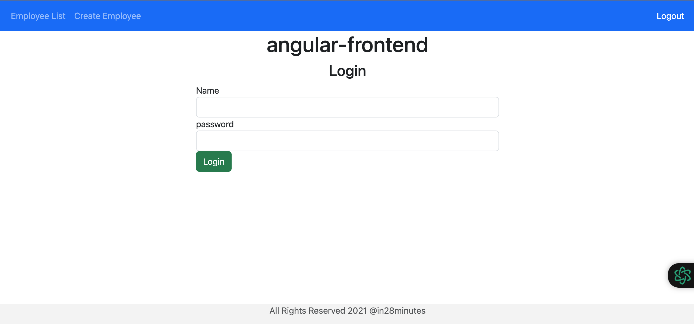
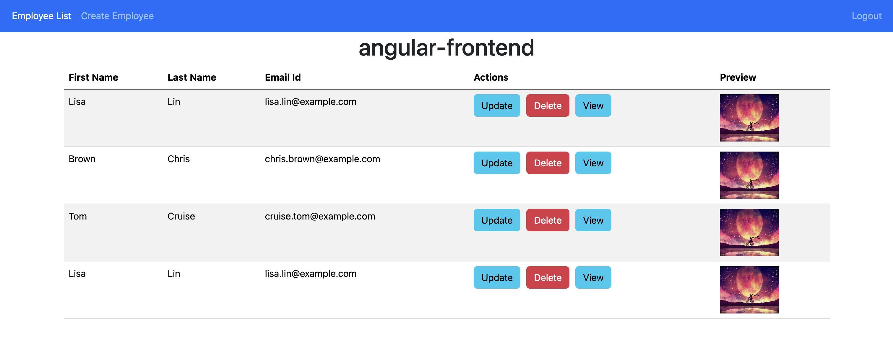
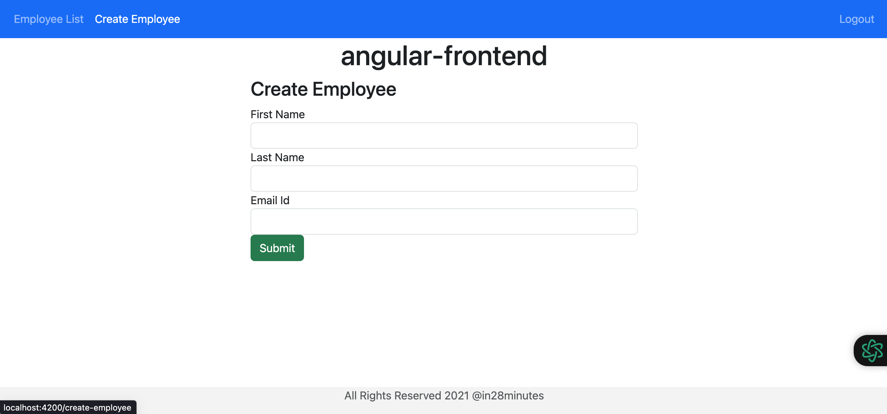
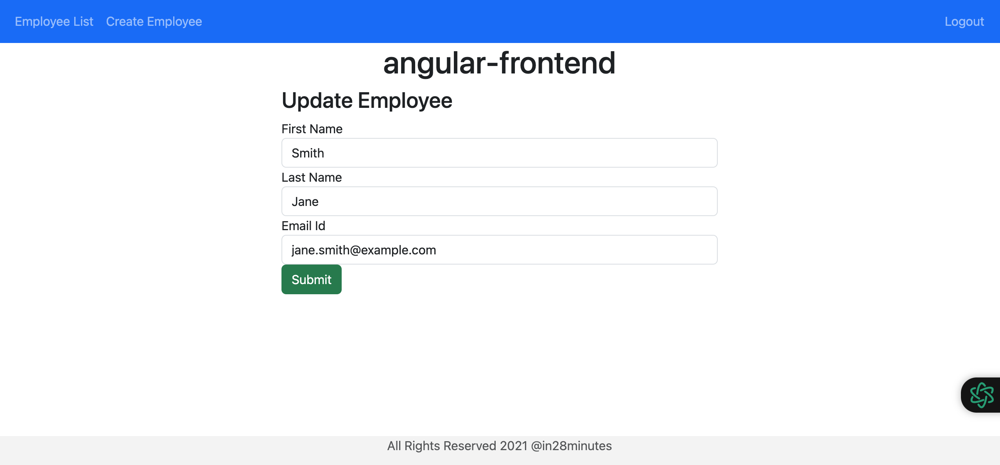
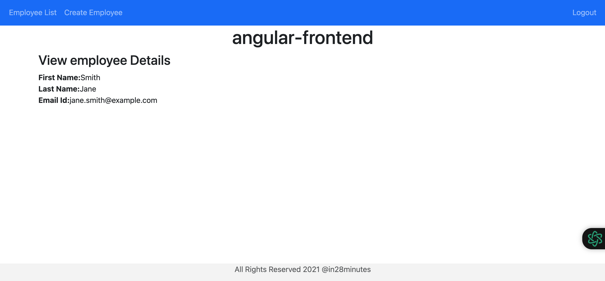

# AngularFrontend with CRUD operations and JWT

This project was generated with [Angular CLI](https://github.com/angular/angular-cli) version 16.0.5.

## Development server

Run `ng serve` for a dev server. Navigate to `http://localhost:4200/`. The application will automatically reload if you change any of the source files.

## screenshots

### Authorisation System(JWT)

    

Name: admin 
Password: admin

## Employee Table

    

## Create Employee

    

## Update Employee

    

## View Employee

    

